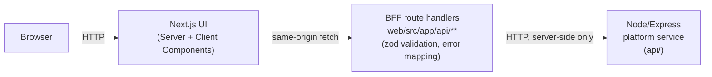

# Travel Approvals

A small, full-stack travel-request approvals app: list requests, view one,
create one, approve or reject it.

**Live demo:** https://demo.sydprojects.com/travel-approvals

## What it is

- **`web/`** - Next.js (App Router, TypeScript strict mode). The UI, plus a
  thin BFF layer implemented as Next.js route handlers.
- **`api/`** - Express, plain JS. Plays the role of an existing downstream
  "platform service" the BFF sits in front of. Its business logic (the
  travel-request domain, validation rules, the pending-to-approved/rejected
  transition rule) is independent of the UI.
- **`docs/requirements.md`** - acceptance criteria written before any test
  or component code, each tagged with an ID and which test file verifies it.

## Architecture



The BFF is not a separate deployable service; it is Next.js route handlers
living inside `web/`. It has no independent scaling or deployment need here,
so a third package would be indirection without benefit. The browser never
talks to `api/` directly; only the BFF does, from the server side.

Server Components fetch initial page data (list, detail) by calling the same
data-access module the BFF uses, directly, without a self-referential HTTP
round trip. Client-side mutations (create, approve, reject) go through the
BFF's `/api/**` route handlers, which is where zod validation and error
mapping actually live.

## Run it

### Docker

```bash
docker compose up --build
```

- Web: http://localhost:3000
- API: http://localhost:4000

### Locally, without Docker

```bash
cd api && npm install && npm start        # http://localhost:4000
cd web && npm install && npm run dev      # http://localhost:3000
```

## Tests

```bash
cd api && npm test                        # Node's built-in test runner + supertest
cd web && npm test                        # Vitest + Testing Library + jest-axe
cd web && npm run e2e                     # Playwright, incl. @axe-core/playwright
```

## Responsive

Checked with Playwright at a 375px phone viewport across every page: no
horizontal overflow, and the create form's date-input row stacks to one
column below 480px instead of squeezing two native date pickers into an
unusably narrow track (`web/e2e/responsive.spec.ts`).

## Accessibility

Target: WCAG 2.2 AA. Checked with tooling, not assumed:

- **jest-axe** on components in isolation (Vitest).
- **@axe-core/playwright** against every real page in a real browser (home,
  detail, create, create-with-errors).
- A **keyboard-only Playwright test** drives the full create -> approve flow
  with no mouse: Tab/Enter/typing only, asserting focus lands on expected
  controls at each step, plus a dedicated no-keyboard-trap check on every
  page tabbing forward and back.
- Landmarks and heading order: one `h1` per page, a labelled `region` for
  the request list, `nav` for primary navigation.
- Every form input has a real `<label>`; validation errors are linked via
  `aria-describedby`, and focus moves to the first invalid field on an
  invalid submit.
- Focus moves deliberately to each page's heading after a client-side route
  change, including after a successful create (which also announces
  "Request created." through a persistent `role="status"` region).
- Async outcomes (create, approve, reject) are announced through an
  `aria-live="polite"` region.

<!-- EDUARDO: decisions -->

## How this was built

- Wrote `docs/requirements.md` first: every acceptance criterion got an ID
  and a named test file, before any test or component existed.
- Built test-first per slice: a failing test against a not-yet-existing
  component or route handler, confirmed red, then the implementation to
  turn it green.
- Built with an agentic workflow (Claude Code, with Codex handling one
  piece), with my own review at each step rather than at the end.
- Playwright e2e and axe caught two real bugs unit tests missed entirely: a
  Server Component passing a function prop to a Client Component (silently
  broke the detail page), and a 3.29:1 contrast failure on the Approve
  button (fixed to 5.02:1).
- One agent-written e2e test (keyboard-trap detection) was flaky; found and
  fixed the actual root cause (a wrap-to-`document.body` case the test
  wasn't accounting for), not just retried until green.
- Verified `docker compose up` actually builds and runs both services from
  a clean clone, not just the working copy.

No invented users, metrics, or production claims beyond what's stated above.
