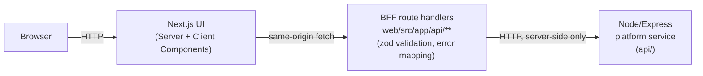

# Travel Approvals

A small, full-stack travel-request approvals app: list requests, view one,
create one, approve or reject it. Built as portfolio evidence for a
frontend-leaning Software Engineer role, exercising React/Next.js,
TypeScript, a BFF layer in front of a downstream service, accessibility
fundamentals, and tests written from requirements before implementation.

## What it is

- **`web/`** - Next.js (App Router, TypeScript strict mode). The UI, plus a
  thin BFF layer implemented as Next.js route handlers.
- **`api/`** - Express, plain JS. Plays the role of an existing downstream
  "platform service" the BFF sits in front of. Its business logic (the
  travel-request domain, validation rules, the pending-to-approved/rejected
  transition rule) is independent of the UI.
- **`docs/requirements.md`** - acceptance criteria written before any test
  or component code, each tagged with an ID and which test verifies it.

## Architecture



The BFF is not a separate deployable service; it is Next.js route handlers
living inside `web/`. It has no independent scaling or deployment need here,
so a third package would be indirection without benefit. The browser never
talks to `api/` directly; only the BFF does, from the server side.

Server Components fetch initial page data (list, detail) by calling the same
data-access module the BFF uses, directly, without a self-referential HTTP
round trip. Client-side mutations (create, approve, reject) go through the
BFF's `/api/**` route handlers, which is where zod validation and error
mapping actually live.

## Run it

### Docker

```bash
docker compose up --build
```

- Web: http://localhost:3000
- API: http://localhost:4000

### Locally, without Docker

```bash
cd api && npm install && npm start        # http://localhost:4000
cd web && npm install && npm run dev      # http://localhost:3000
```

## Tests

```bash
cd api && npm test                        # Node's built-in test runner + supertest
cd web && npm test                        # Vitest + Testing Library + jest-axe
cd web && npm run e2e                     # Playwright, incl. @axe-core/playwright
```

CI (`.github/workflows/ci.yml`) runs lint, typecheck, unit tests, build, and
the full e2e/axe suite on every push.

## Responsive

Checked with Playwright at a 375px phone viewport across every page: no
horizontal overflow, and the create form's date-input row stacks to one
column below 480px instead of squeezing two native date pickers into an
unusably narrow track (`web/e2e/responsive.spec.ts`).

## Accessibility

Target: WCAG 2.2 AA. Checked with tooling, not assumed:

- **jest-axe** on components in isolation (Vitest).
- **@axe-core/playwright** against every real page in a real browser (home,
  detail, create, create-with-errors) - this is what actually caught a
  3.29:1 contrast failure on the Approve button (fixed to 5.02:1) and a
  Server-Component-to-Client-Component prop bug that silently broke the
  detail page (see below).
- A **keyboard-only Playwright test** drives the full create -> approve flow
  with no mouse: Tab/Enter/typing only, asserting focus lands on expected
  controls at each step.
- Landmarks and heading order: one `h1` per page, a labelled `region` for
  the request list, `nav` for primary navigation.
- Every form input has a real `<label>`; validation errors are linked via
  `aria-describedby`.
- Focus moves deliberately to each page's heading after a client-side route
  change (not on the very first hard load, and not during the
  still-undecided create-submit step - see below).
- Async outcomes (create, approve, reject) are announced through an
  `aria-live="polite"` region.

## The three decisions (resolved)

Per the project's brief, three product/UX decisions were deliberately left
stubbed rather than decided by the agent, each with a documented trade-off
in `docs/requirements.md`. They were later explicitly handed back to the
agent to resolve (2026-09-30). Full reasoning for each is in
`docs/requirements.md` under "Resolved decisions"; summary:

1. **Focus management after create-submit** - resolved: navigate to the
   new request's own page, whose heading names the requester, so focus
   lands somewhere that confirms *which* request was created
   (`web/src/app/requests/new/page.tsx`, `web/src/app/requests/[id]/page.tsx`).
2. **BFF error-mapping shape** - resolved: structured `{ error, fields }`
   (`web/src/lib/mapError.ts`), so the BFF's own server-side validation can
   surface real per-field errors, not just duplicate client-side checks.
3. **Empty-state copy/behavior** - resolved: added a "Create your first
   request" call-to-action (`web/src/components/TravelRequestList.tsx`).

All 26 requirements now map to a passing test - no stubbed failures
remain.

## How this was built

This was built with Claude Code in an agentic workflow, with human review at
each step rather than at the end. The process, in the order it actually
happened:

1. Explored the pre-existing demo repo (a generic React+Vite task-tracker
   over a plain Express API) and proposed a step-by-step plan before writing
   any code.
2. Wrote `docs/requirements.md` first: every acceptance criterion got an ID
   and a named test type, including the three decisions above, before any
   test or component existed.
3. Built test-first per slice: a failing test against a not-yet-existing
   component or route handler, confirmed red, then the implementation to
   turn it green. This is visible in the commit history (e.g. the
   `TravelRequestList` component was written after its test file).
4. Ran lint, typecheck, unit tests, and build after every step, not just at
   the end, and only moved on once they were clean.
5. Added Playwright e2e and `@axe-core/playwright` last, against the real
   running app rather than mocked components. This is what actually caught
   two real bugs that every earlier unit test had missed, because unit
   tests render components in isolation and never cross a real
   Server-Component/Client-Component boundary or render in an actual
   browser:
   - A Server Component was passing an inline function prop to a Client
     Component. Next.js caught this at runtime and silently rendered its
     own error page; the axe test flagged that error page's markup as
     "content not contained by landmarks," which is what surfaced it.
   - The Approve button's green-on-white contrast measured 3.29:1 against a
     4.5:1 requirement. Not visible by eye at a glance; caught by the axe
     `color-contrast` rule.
6. The keyboard-only e2e test itself needed several honest fixes along the
   way, including a React Strict Mode double-effect bug in the route-focus
   logic that only showed up as flaky test failures, not a bug in the
   original written-by-hand assertions but in the auto-focus implementation
   they were exercising. Those are in the commit history too, not smoothed
   over.
7. Verified `docker compose up` actually builds and runs both services from
   a clean clone (a separate `git clone` into a scratch directory, not the
   working copy), including real inter-service networking (the BFF calling
   the platform API by its Docker Compose service name). Host-port access
   was blocked by this specific development VPS's firewall configuration,
   unrelated to the project; verified instead via `docker exec` against the
   containers directly.
8. Audited every acceptance criterion in `docs/requirements.md` against the
   actual test suite rather than assuming earlier claims were accurate.
   Found and closed several gaps this way: `REQ-A11Y-3` (focus visibility)
   and `REQ-STATE-1` (loading states) had zero automated coverage despite
   being marked verified; `REQ-A11Y-6` (contrast) claimed a manual check
   that had never been performed, so the WCAG formula was run against all
   12 color pairings actually used in the app instead. Responsiveness
   (required by the brief) had never been checked at all; found and fixed
   two real overflow risks at phone width.
9. `web/e2e/no-keyboard-trap.spec.ts` was written by Codex (GPT), not
   Claude - delegated deliberately to split cost/role across two paid
   plans. Getting Codex to actually run required working around Codex's
   own sandbox being scoped to a different directory than this project
   (staged a clone inside the trusted path, handed Codex the task there,
   reviewed its diff, then applied it here after verifying it passed).
   That detour is the honest record of what "delegating to an agent"
   costs in practice, not a smoothed-over "and then Codex wrote it."
10. Pushed to GitHub and let real CI run before touching the three stubbed
    decisions. It failed, correctly, on exactly the one intentionally
    failing test (`REQ-BFF-2`) - confirmed from GitHub's API, not assumed.
    Only after seeing that real, expected red did the three decisions get
    resolved (this section's own trade-offs, and `docs/requirements.md`'s
    "Resolved decisions", record the reasoning), each with its tests
    updated to assert the resolved behavior rather than the stub. Full
    suite is green locally; next push settles whether it's green on CI.

No invented users, metrics, or production claims. This has not been
deployed anywhere; "verified" above means run and checked in this
environment, not observed in production traffic.
